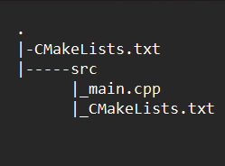

<h1 align="center">Описание</h1>

<body>Это чат сервер реализованный на С++. 

В данной работе реализованно:

<li>Отправка публичных сообщений

<li>Отправка приватных сообщений

<li>Смена имени пользователя в чате

<li>Выдача списка онлайн пользователей в чате

<h1 align="center">Структура проекта</h1>

<h1 align="center">JSON файлы</h1>

