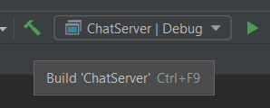

<h1 align="center">Описание</h1>

<body>Это чат сервер реализованный на С++. 

В данной работе реализованно:

<li>Отправка публичных сообщений

<li>Отправка приватных сообщений

<li>Смена имени пользователя в чате

<li>Выдача списка онлайн пользователей в чате

<h1 align="center">Структура проекта</h1>

<h1 align="center">JSON файлы</h1>

Для работы c JSON файлами используется <a href="https://github.com/nlohmann/json">JSON for Modern C++</a>(установлен с помощью <a href="https://github.com/microsoft/vcpkg">vcpkg</a>).

<h1 align="center">WebSockets</h1>

Для организации работы с WebSockets используется <a href="https://github.com/uNetworking/uWebSockets">uWebSockets</a>(установлен с помощью <a href="https://github.com/microsoft/vcpkg">vcpkg</a>).

<h1 align="center">Установка библиотек с помощью <a href="https://github.com/microsoft/vcpkg">vcpkg</a></h1>

<a href ="https://blog.jetbrains.com/clion/2023/01/support-for-vcpkg-in-clion/">Данный пример реализован с помощью IDE JetBrains version 2023.1 и выше</a>

<h1 align="center">Установка на примере IDE Clion</h1>

1. С помощью инструмента для загрузки из удаленного репозитория, разместим исходные файлы в удобный каталог. <a href="https://github.com/Sereys13/ChatServer">Ссылка на репозиторий</a> 

2. Выполняем сборку проекта, сформировываем исполняемый файл search_engine.exe 

